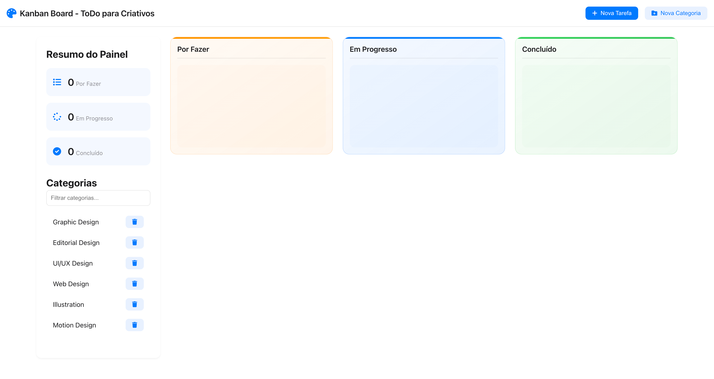

# 🎨 Kanban Board - ToDo para Criativos

Um quadro Kanban moderno e elegante, projetado especificamente para profissionais criativos, com uma interface inspirada no design minimalista da Apple.



## 📋 Funcionalidades

- **Gestão Visual de Tarefas**
  - Três colunas com gradientes modernos:
    - 🟠 Por Fazer
    - 🔵 Em Progresso
    - 🟢 Concluído
  - Indicador de progresso visual em cada tarefa
  - Design responsivo e intuitivo

- **Organização de Tarefas**
  - Criação de tarefas com título e descrição
  - Suporte para upload de imagens
  - Sistema de categorias personalizáveis
  - Drag & drop para mover tarefas entre colunas

- **Interface Moderna**
  - Design inspirado na estética Apple
  - Efeitos de vidro fosco (frosted glass)
  - Animações suaves
  - Gradientes sutis e modernos

## 🚀 Como Usar

1. **Criar Nova Tarefa**
   - Clique no botão "Nova Tarefa"
   - Preencha o título e descrição
   - Adicione uma imagem (opcional)
   - Selecione ou crie uma categoria
   - Clique em "Guardar"

2. **Gerir Categorias**
   - Use o botão "Nova Categoria"
   - Atribua um nome e cor à categoria
   - As categorias aparecem no menu lateral

3. **Mover Tarefas**
   - Arraste e solte as tarefas entre colunas
   - Ou use o menu dropdown em cada tarefa
   - O progresso é atualizado automaticamente

## 💻 Tecnologias Utilizadas

- HTML5
- CSS3 (com variáveis CSS para temas)
- JavaScript (Vanilla)
- LocalStorage para persistência de dados
- Drag & Drop API
- Font Awesome para ícones

## 🎯 Recursos Especiais

- **Persistência de Dados**
  - Todas as tarefas e categorias são salvas localmente
  - Não requer backend ou banco de dados

- **Acessibilidade**
  - Interface otimizada para leitores de tela
  - Contraste adequado para melhor legibilidade
  - Suporte a navegação por teclado

- **Performance**
  - Carregamento rápido
  - Animações otimizadas
  - Sem dependências externas pesadas

## 🛠️ Instalação

1. Clone o repositório:
   ```bash
   git clone [URL do repositório]
   ```

2. Abra o ficheiro `index.html` no seu navegador

3. Comece a usar! Não é necessária nenhuma configuração adicional.

## 📱 Compatibilidade

- Chrome (recomendado)
- Safari
- Firefox
- Edge
- Dispositivos móveis e tablets

## 🤝 Contribuições

Contribuições são bem-vindas! Sinta-se à vontade para:
- Reportar bugs
- Sugerir novas funcionalidades
- Enviar pull requests

## 📄 Licença

Este projeto está sob a licença MIT. Consulte o ficheiro `LICENSE` para mais detalhes.

## 👨‍💻 Autor

Desenvolvido por Patricio Brito © 2024.

---

⭐️ Se este projeto foi útil para você, considere dar uma estrela no GitHub!
